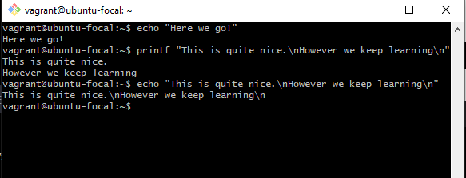

# LINUX COMMANDS

## Some Basic Essential Linux Commands

__1. Print Command:__  When displaying text on the terminal, the **echo** command is commonly used. It allows you to print a single line of text straightforwardly. However, when you need to print text with the requirement of moving to a new line or formatting, the **printf** command becomes essential. Unlike echo, printf provides more control over the formatting of the output and allows you to include newline characters. This can be seen as displayed below. 
 

__2. apt-get Command:__ It is part of the Advanced Package Tool (APT) system and is used for installing, upgrading, and managing software packages on Linux. It is almost important to note that **sudo** is used when using the **apt-get** to allow adminstrive privilges.  
Here is a list of things possible using the **apt-get** command;

1. INSTALL: It is used for installing new software packages. To install a package, simply use the install sub-command of apt-get followed by the name of the package you want to add. For example  
**sudo apt-get install package_name**

1. REMOVE: It is used removing or uninstalling packages. To remove a package, simply use the remove sub-command of apt-get followed by the name of the package you want to remove. For example  
**sudo apt-get remove package_name**

1. PURGE: Unlike the remove command, this removes the  packages along with configuration files. To purge a package, use the purge command followed by the package name For example  
**sudo apt-get purge package_name**

1. UPDATE: The update sub-command of apt-get is employed to refresh package lists from repositories, ensuring you have the latest information about available packages. This step is crucial before installing or upgrading packages on your system. Running update ensures that your package manager downloads the most recent package details, providing you with accurate and up-to-date information. For example  
**sudo apt-get update**

1. UPGRADE: The upgrade sub-command of apt-get is used to ensure that all installed packages on the system are upgraded to their latest available versions. To upgrade a package, simply use the upgrade sub-command of apt-get followed by the name of the package you want to upgrade. For example  
**sudo apt-get upgrade**

1. DIST-UPGRADE: It carries out a distribution-wide upgrade, ensuring that the entire system is transitioned to the latest available version. This includes upgrading the kernel, system libraries, and resolving complex package dependencies to maintain a coherent and functional system. For example  
**sudo apt-get dist-upgrade**

1. SEARCH: The search sub-command of apt-get allows users to explore available packages in the distribution's repositories based on specified search terms. This command helps users discover relevant software packages that match their search criteria, facilitating the identification and installation of desired applications. For example  
**apt-cache search search_term**

__3. History Command:__ The history command is used to display a list of previously executed commands in the terminal session. This command is useful for reviewing and repeating past commands, making it a convenient tool for command-line users to track and manage their command history. This can be seen as displayed below. 

__4. Permission Commands:__ The permission command determines the access rights for users (owners of the file, groups associated with the file, and others which is everyone else) to a file or directory. The absence of a permission is denoted by '-'. The permission command typically displays the permissions in a format like "rwxr-xr--,"  The three basic permissions are:

1. **r (read)**: Allows users to view the contents of a file or list the contents of a directory.
1. **w (write)**: Grants users the ability to modify the contents of a file or create, delete, and rename files within a directory.
1. **x (execute)**: Permits users to execute a file as a program or traverse (access) a directory.

__5. Process Commands:__ A process command is used to manage and monitor running processes, providing control and information about the execution of programs on the system. It is almost similar to the task manager on your windows OS. Here are some process commands;
1. ps: Gives the status of processes running for a user, and when used with a specific process ID (PID), it provides details on a particular process.

1. bg: Sends a process to the background, allowing it to continue running while the user interacts with the terminal.

1. fg: Runs a stopped process in the foreground, bringing it back to an active state.
1. top: Displays details on all active processes, providing real-time information on system resource usage. You use $top to achieve this and **q command** is used to exit the window.

1. df: Shows free hard disk space on the system, providing information on available storage. **df-h** can be used to make the file sizes more readable.

1. kill PID: Terminates a process with the specified Process ID (PID), allowing users to end a running program.
